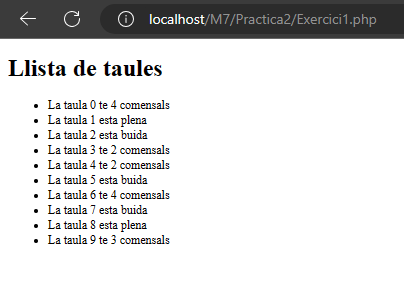
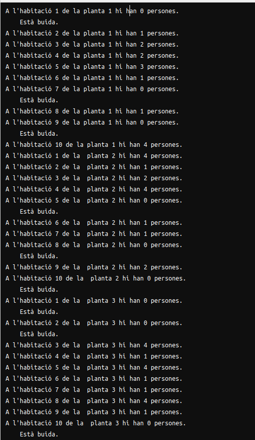
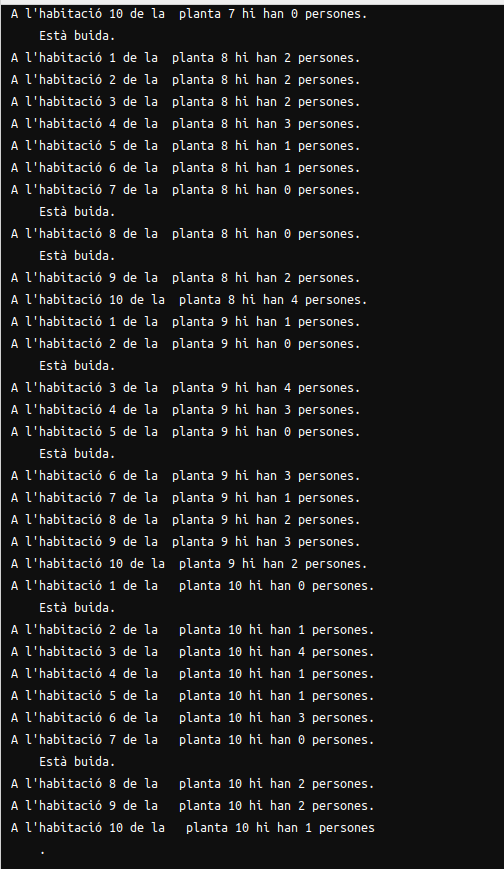

# Introduccio_PHP ITICBCN

## Exercici 1

Al primer exercici hem de gestionar un restaurant on tenim 10 taules
amb un màxim de 5 comensals per taula i volem que cada cop que obrim la pàgina
hi hagi una quantitat aleatòria de comensals per cada taula. 

El plantejament ha sigut el seguent:

Hem fet un array de 10 taules on en cada una hem posat un número aleatori amb
el [rand()](https://www.php.net/manual/en/function.rand.php). 
Després hem fet un for on recorrem totes les taules i instanciat cada taula amb un numero aleatori.
Per que quedés millor hem fet que en el case de que la taula tingui 5 o 0 comensals mostri un missatge diferent.

## Exercici 2

El **exercici 2** ens planteja el problema de tenir un hotel que te 5 pisos, i cadascun en te 10 habitacions, que aquestes tenen fins a 4 habitants maxims. Aquest exercici, en el meu cas, no vaig acabar el exercici a temps, pero tinc el plantejament de com es faria sense codi.
Els pasos que jo seguiria serien els seguents:
1. El plantejament es crear dos arrays, o sigui un array d'arrays. 
2. En tema codi, es crear un 'for' i a dins unaltre 'for' per donar-hi un numero random del 0 al 4, per a que a cada habitacio se li doni un numero de habitants aleatori.
3. En el moment de fer el echo, es faria dins de dos for each. Primer aniriem a per les plantes, i dins el for each de les habitacions, amb un element de lista amb un echo de php.
Aqui es veu la imatge del codi funcionant, de Joel.

